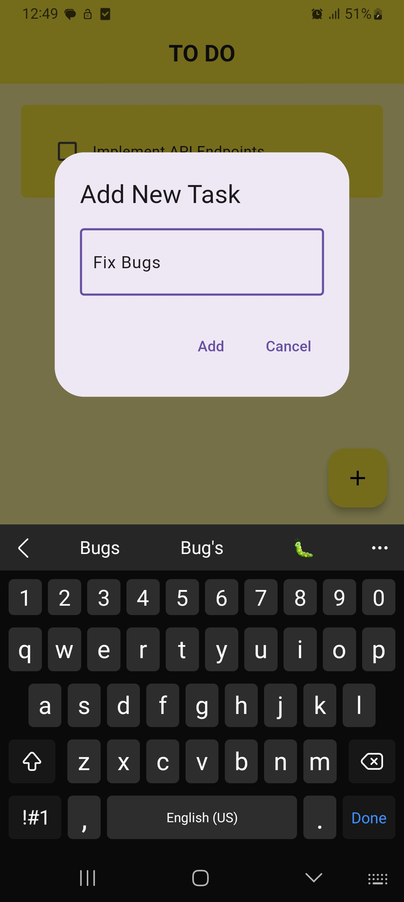
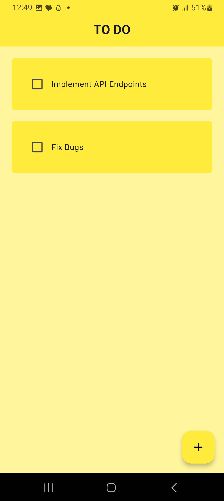
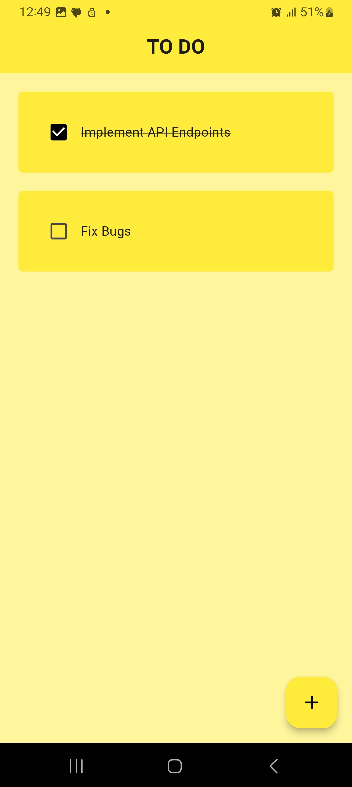
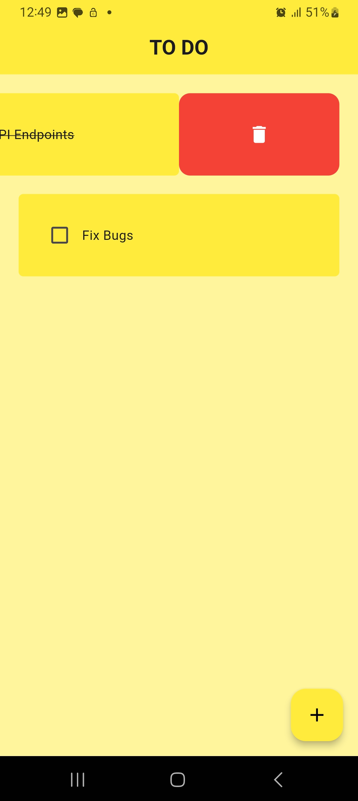

# To Do App

A simple and intuitive To Do application built with Flutter, utilizing Hive for efficient local storage and the `flutter_slidable` package to enhance user interactions with list items.

## Features

- **Add Tasks**: Easily create new tasks and add them to your To Do list.
- **Delete Tasks**: Quickly remove tasks from your list using swipe gestures.
- **Local Storage**: Store your tasks locally on the device using Hive, ensuring fast and reliable access.
- **User-Friendly Interface**: A clean and straightforward design for seamless navigation.
## Screenshots

<table>
  <tr>
    <th>Screen</th>
    <th>Screenshot</th>
  </tr>
  <tr>
    <td>Task List</td>
    <td></td>
  </tr>
  <tr>
    <td>Add Task Screen</td>
    <td></td>
  </tr>
  <tr>
    <td>Task Deletion</td>
    <td></td>
  </tr>
  <tr>
    <td>Completed Tasks</td>
    <td></td>
  </tr>
</table>


## Getting Started

This section outlines the steps required to set up and run the project on your local machine for development and testing purposes.

### Prerequisites

Before you begin, ensure you have the following installed:

- [Flutter SDK](https://flutter.dev/docs/get-started/install)
- A code editor (such as [VS Code](https://code.visualstudio.com/) or [Android Studio](https://developer.android.com/studio))

### Installation

1. **Clone the Repository**:
   ```bash
   git clone https://github.com/yourusername/todo_app.git
   cd todo_app

